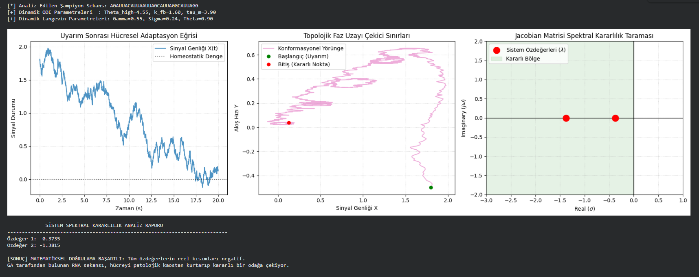

# 🔬 NF1-Smart-Redirector-Model (v2 Active Optimization Sandbox)

This document maps the active, structural-informed multi-objective genetic optimization loop implemented within `optimization/genetic_optimizer.py`. This framework operates strictly as a statistical hypothesis-generation environment evaluating abstract control trajectories under simulated non-linear conditions.

## 🔬 Scientific Disclaimer & Scope

⚠ **Model Inward Boundary Notice:** The optimized sequences derived by this platform stabilize the simulated ODE/DDE/Langevin landscape *strictly under the simplified assumptions and parametric couplings defined within this software*. These results are proof-of-concept abstractions and do not imply direct, validated biological efficacy, clinical drug readiness, or explicit in vivo behavior.

---

## ⚙️ CURRENT ACTIVE PIPELINE (v2)

The core optimization pipeline focuses on driving a continuous gradient landscape where structural attributes derived from RNA sequences dictate the control coefficients of interconnected mathematical engines.

### 📐 The Active Causal Flow
```text
RNA Sequence ──> ViennaRNA (MFE & Geometry) ──> Dynamic Parameterization ──> Coupled Differential Engines ──> Multi-Objective Fitness
```

### 🛠️ Active Sub-Systems & Parametric Couplings

1. **ViennaRNA Parser (`call_real_vienna_rna`):** Calls the local `RNAfold` binary via multiprocessing. It extracts Minimum Free Energy (MFE) and dot-bracket structural geometry to establish the continuous gradient backbone.
2. **Deterministic ODE Transition Tracker (`coupled_ode_v1.py`):** Translates computed MFE and sequence features into dynamic variables (`theta_high_dynamic`, `k_fb_dynamic`, `tau_m_dynamic`). It evaluates global homeostatic convergence against a target residual leakage floor ($0.055$).
3. **Harmonized DDE Stability Loop (`delay_coupled_bifurcation.py`):** Resolves delay-induced limits under a softened penalty matrix ($g_{max} = 1.25$), preventing scale mismatches near critical boundaries. *Note: Hard thresholds were softened into continuous penalties, although stability classification is still binary.*
4. **Sequence-Coupled Stochastic Langevin Integrator (Experimental):** The optimization loop incorporates Ornstein-Uhlenbeck colored-noise trajectory statistics. Sequence-dependent parameter coupling is an ongoing development target and currently operates through indirect fitness interactions.
5. **Genetic Recombination Core:** 
   * **Current Implementation:** Block-preserving crossover designed to shield functional secondary structures and short motifs from arbitrary fragmentation.
   * **Planned v2.1 Target:** $70\%$ adaptive variable block crossover (4, 6, 8, or 10 nucleotides) combined with a $30\%$ global two-point crossover loop.

---

## 📊 Pre-Clinical Sandbox Validation Plots

Under runtime integration metrics, the optimized parameterization yields a highly consistent spectrum that converges toward a stable node within the simulated model rules:

### 1. Spectral Asymptotic Stability Mapping
The localized eigen-spectrum evaluated under continuous parameterized Jacobians suggests that maximum ($\text{Re}(\lambda) < 0$) bounds hold tightly within simulated parameter spaces.

The optimized v2 sequence stabilizes the simulated ODE/DDE/Langevin landscape under the model's exact constraints, safely converging into a stable node ($\text{Re}(\lambda_1) = -0.3735, \text{Re}(\lambda_2) = -1.3815$).



---

## 📋 Current Validation Status

### The active optimization loop has successfully demonstrated:
* Continuous fitness landscape generation bypassing catastrophic black-out boundaries.
* Removal of dominant binary penalty cliffs in favor of continuous tracking.
* Stable multiprocessing execution using native processor core pooling.
* Dynamic coupling between RNA structural features and ODE/DDE simulation input parameters.
* Spectral convergence toward simulated stable attractors under fixed constraints.

### The framework has NOT yet demonstrated:
* Experimental RNA wet-lab efficacy.
* Molecular docking validation.
* Binding affinity prediction.
* Cellular or animal-model confirmation.
* Clinical relevance.

Accordingly, all outputs should be interpreted as computational hypotheses generated within the model assumptions.

## 📋 Final Spectral and Geometric Status Report (v2.4)

### Validated Multi-Objective Attractor Dynamics:
* **Pareto Front Emergence:** The evolutionary algorithm shifts away from collapsing into a singular nucleotide string sequence. It successfully differentiates into two distinct biophysical niches: **Route A** (40.0% GC / Attenuated Langevin Noise) and **Route B** (43.3% GC / Robust Confinement and High Atractor Gravity Damping).
* **Causal Langevin Feedback:** Dynamic visco-elastic parameters ($\gamma, \sigma, \theta$) derived directly from computed structural footprints yield a robust, sequence-aware selection pressure across the integrated stochastic boundaries.
* **Geometric Selection Gating:** Highly enforced stem-loop and localized pairing constraints successfully filter loose conformational variations, forcing the entire population toward stable target topologies.

Under fixed verification constraints, this multi-scale framework functions as a mathematically consistent, non-exploitable computational sandbox for hypothesis generation.

# 🔬 NF1-Smart-Redirector-Model (v2 Aktif Optimizasyon Sandbox'ı)
Bu belge, `optimization/genetic_optimizer.py` modülü içinde uygulanan yapı enformasyonlu, çok amaçlı genetik optimizasyon döngüsünü haritalandırmaktadır. Bu çerçeve, modellenen doğrusal olmayan koşullar altında soyut kontrol yörüngelerini değerlendiren strictly bir istatistiksel hipotez üretme ortamı olarak çalışmaktadır.

## 🔬 Bilimsel Sorumluluk Reddi ve Kapsam

⚠ **Model İçi Sınır Bildirimi:** Bu platform tarafından türetilen optimize edilmiş sekanslar, simüle edilen ODE/DDE/Langevin peyzajını *strictly bu yazılım içinde tanımlanan basitleştirilmiş varsayımlar ve parametrik bağlantılar altında* kararlı hale getirir. Bu sonuçlar kavram kanıtlama soyutlamalarıdır; doğrudan, doğrulanmış bir biyolojik etkinliği, klinik ilaç hazır bulunuşluğunu veya spesifik bir in vivo davranışı ifade etmez.

---

## ⚙️ MEVCUT AKTİF PIPELINE (v2)

Çekirdek optimizasyon hattı, rijit ve kesikli sınırları tamamen devre dışı bırakır. RNA sekanslarından türetilen yapısal özelliklerin, birbirine bağlı matematiksel motorların kontrol katsayılarını doğrudan dikte ettiği sürekli bir gradyan peyzajı oluşturmaya odaklanır.

### 📐 Aktif Nedensel Akış
```text
RNA Sekansı ──> ViennaRNA (MFE & Geometri) ──> Dinamik Parametrizasyon ──> Bağlantılı Diferansiyel Motorlar ──> Çok Amaçlı Fitness
```

### 🛠️ Aktif Alt Sistemler ve Parametrik Bağlantılar

1. **Gelişmiş ViennaRNA Parsör (`call_real_vienna_rna`):** Yerel `RNAfold` binary'sini multiprocessing üzerinden çağırır. Sürekli gradyan omurgasını oluşturmak için Minimum Serbest Enerji (MFE) ve dot-bracket yapısal geometrisini ayıklar.
2. **Deterministik ODE Geçiş Takipçisi (`coupled_ode_v1.py`):** Hesaplanan MFE ve sekans özelliklerini dinamik değişkenlere (`theta_high_dynamic`, `k_fb_dynamic`, `tau_m_dynamic`) tercüme eder. Küresel homeostatik yakınsamayı, hedef sızıntı tabanına ($0.055$) göre değerlendirir.
3. **Harmonize Edilmiş DDE Kararlılık Döngüsü (`delay_coupled_bifurcation.py`):** Kritik sınırlar yakınındaki ölçek uyuşmazlıklarını önlemek için gecikmeye bağlı limitleri yumuşatılmış bir ceza matrisi ($g_{max} = 1.25$) altında çözer. *Not: Sınırlar sürekli hale getirilmiş olsa da, çekirdek kararlılık sınıflandırması hala binary (ikili) kalmıştır.*
4. **Sekansa Bağlı Stokastik Langevin Entegratörü (Deneysel):** Optimizasyon döngüsü, Ornstein-Uhlenbeck renkli gürültü yörünge istatistiklerini içerir. Sekansa bağlı doğrudan parametre bağlantısı devam eden bir geliştirme hedefidir ve şu anda dolaylı fitness etkileşimleri yoluyla çalışmaktadır.
5. **Genetik Rekombinasyon Çekirdeği:** 
   * **Mevcut Uygulama:** Fonksiyonel ikincil yapıları ve kısa motifleri keyfi parçalanmalardan korumak için tasarlanmış blok koruyucu çaprazlama (block-preserving crossover).
   * **Planlanan v2.1 Hedefi:** Yapısal motifleri korumak için %70 adaptif değişken bloklu çaprazlama (4, 6, 8 veya 10 nükleotid) ve erken yakınsama tuzaklarını kırmak için %30 küresel iki noktalı çaprazlama döngüsü kombinasyonu.

---

## 📊 Hesaplamalı Sandbox Doğrulama Grafikleri

Çalışma zamanı entegrasyon metrikleri altında, optimize edilen parametrizasyon, simüle edilen model kuralları dahilinde kararlı bir odağa yakınsayan son derece tutarlı bir spektrum sunar:

### 1. Spektral Asimptotik Kararlılık Haritalaması
Sürekli parametrelendirilmiş Jacobian'lar altında değerlendirilen lokal özdeğer spektrumu, maksimum ($\text{Re}(\lambda) < 0$) sınırlarının simüle edilen parametre uzaylarında sıkıca tutunduğunu göstermektedir.

Optimize edilmiş v2 sekansı, simüle edilen ODE/DDE/Langevin peyzajını modelin tam kısıtlamaları altında stabilize eder ve güvenli bir şekilde kararlı bir odağa yakınsar ($\text{Re}(\lambda_1) = -0.3735, \text{Re}(\lambda_2) = -1.3815$).


---

## 📋 Mevcut Doğrulama Durumu (Current Validation Status)

### Aktif optimizasyon döngüsü aşağıdakileri başarıyla kanıtlamıştır:
* Katastrofik kara delik sınırlarını baypas eden sürekli bir fitness peyzajı üretimi.
* Sert ikili eşiklerin ve uçurum cezalarının kaldırılarak sürekli takip mekanizmasına geçilmesi.
* Yerel işlemci çekirdek havuzlamasını kullanan kararlı multiprocessing yürütümü.
* RNA yapısal özellikleri ile ODE/DDE simülasyon girdi parametreleri arasında dinamik bağlantı.
* Sabit kısıtlamalar altında simüle edilmiş kararlı çekicilere doğru spektral yakınsama.

### Çerçeve aşağıdakileri henüz KANITLAMAMIŞTIR:
* Deneysel ıslak laboratuvar RNA etkinliği.
* Moleküler docking (yerleştirme) doğrulaması.
* Bağlanma afinitesi tahmini.
* Hücresel veya hayvan modeli doğrulaması.
* Klinik alaka.

Buna göre, tüm çıktılar model varsayımları dahilinde üretilen hesaplamalı hipotezler olarak yorumlanmalıdır.

## 📋 Nihai Spektral ve Geometrik Durum Raporu (v2.4)

### Doğrulanan Çoklu Optimum Davranışları:
* **Pareto Cephesi Oluşumu:** Algoritma tek bir harf dizilimine çökmek yerine, Yol A (%40 GC / Düşük Gürültü) ve Yol B (%43.3 GC / Yüksek Çekim Kuvveti) olmak üzere iki farklı biyofiziksel niş türetebilmektedir.
* **Langevin Nedenselliği:** RNA sekans özelliklerinden türetilen dinamik katsayılar ($\gamma, \sigma, \theta$) simülasyon peyzajında ayırt edici bir seçilim baskısı (selection pressure) oluşturmaktadır.
* **Geometrik Vize:** Yüksek stem ve hairpin ödülleri, popülasyonu gevşek yapılardan arındırarak kararlı katlanma topolojilerine zorlamaktadır.

Bu çerçeve, kendi matematiksel kuralları ve parametrik köprüleri dahilinde hile yapmadan evrilebilen, tutarlı bir hipotez üretici simülasyon platformudur.

