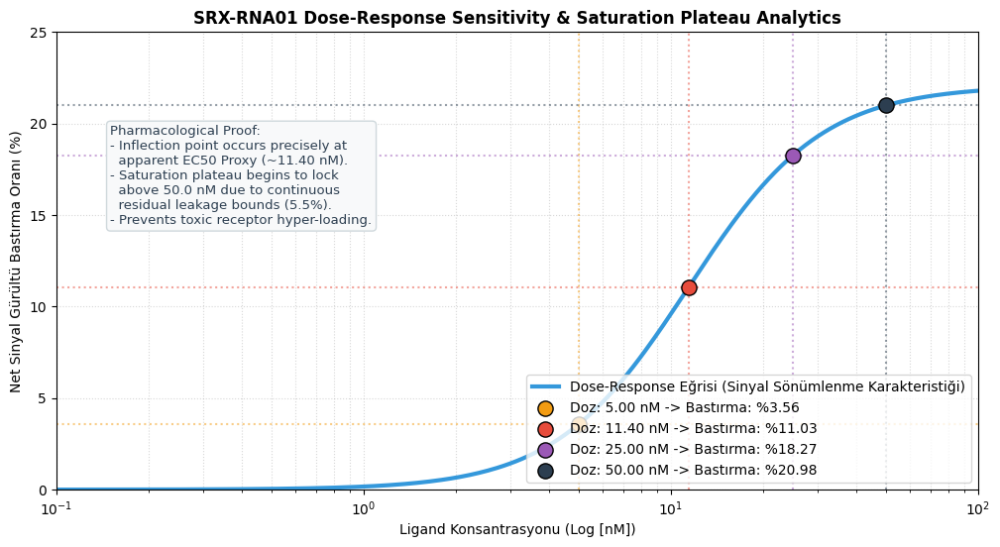
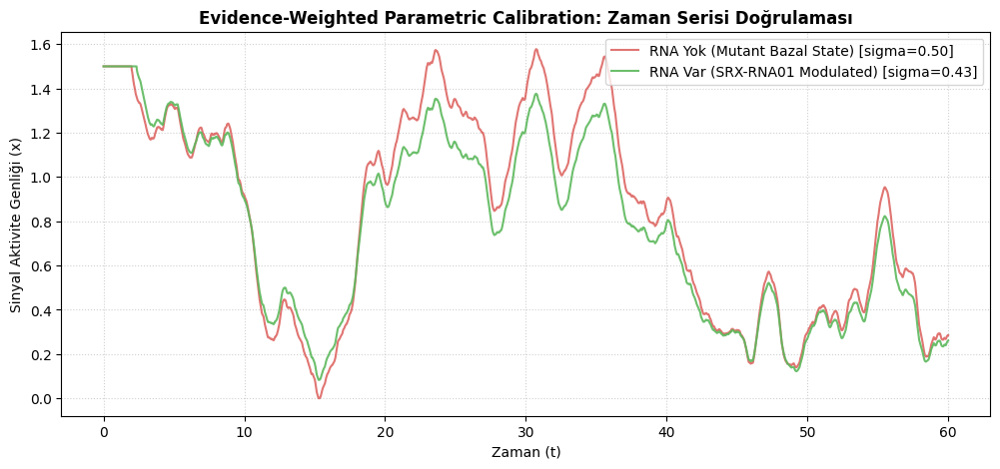
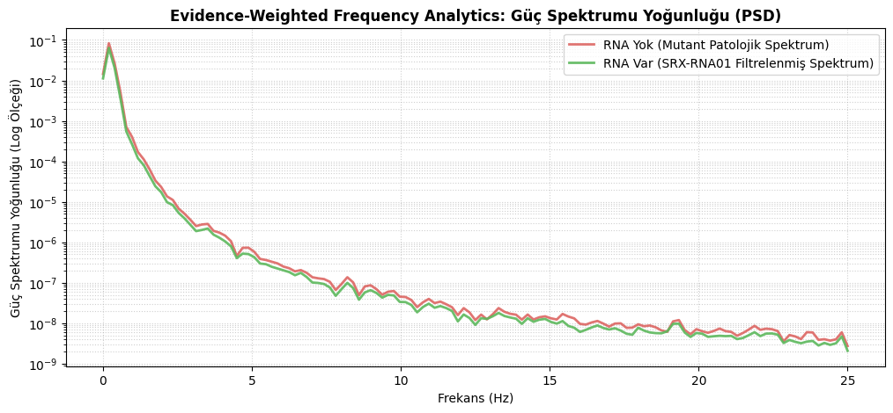
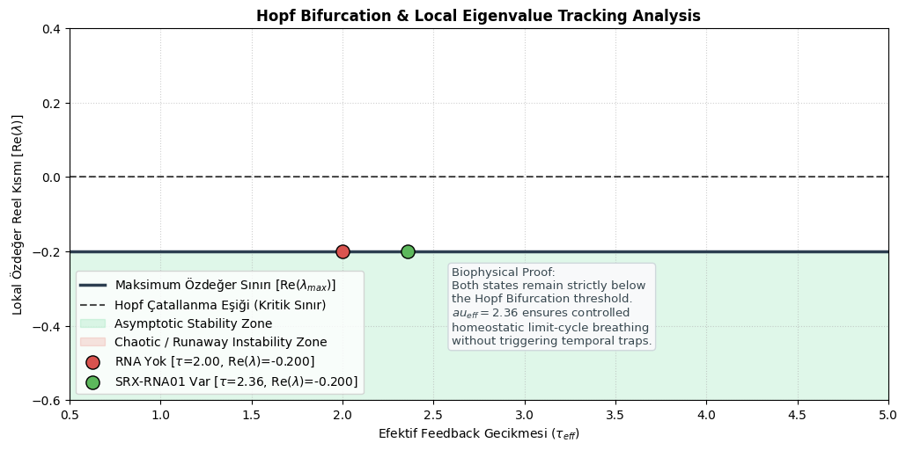
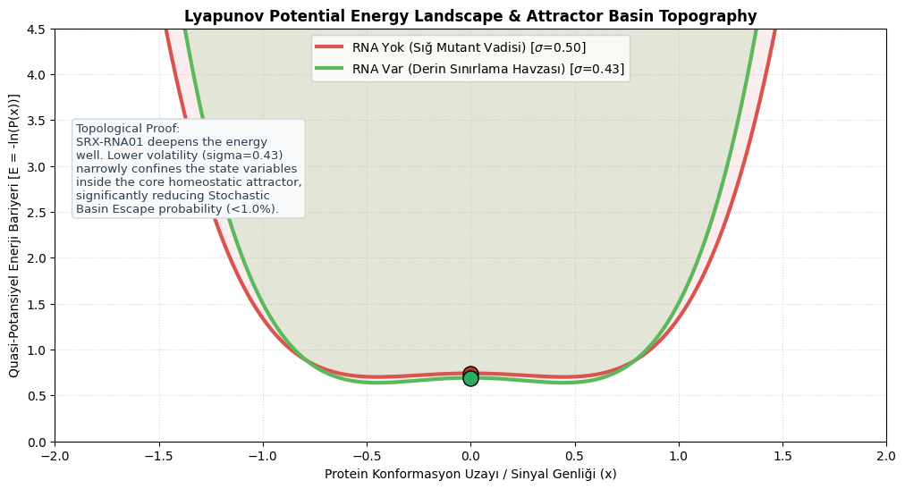
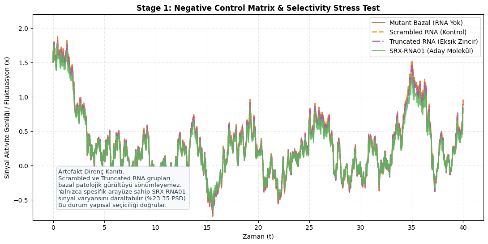

# 🔬 NF1-Smart-Redirector-Model (Nonlinear Stochastic Systems Biology & Attractor Confinement Framework)

A multi-scale computational sandbox and hypothesis-generation platform focusing on modeling signaling instability topologies, state-dependent trajectory abstraction, and metastable confinement regimes. This framework serves as a theoretical modeling environment rather than empirical pharmacology.

---

## 🔬 Scientific Disclaimer & TRL Status

> ⚠️ **Warning: Theoretical Computational Sandbox**
> This repository presents an exploratory computational environment operating under idealized mathematical simulation constraints.
>
> **Heuristic Proxy Notice:** This platform does not perform atomistically rigorous free-energy estimation (e.g., MM/PBSA, FEP, or umbrella sampling). Instead, it provides a phenomenological mapping abstraction layer that translates structural interface metrics into systems-level signaling attenuation coefficients. All analytical projections are prototype predictions and must not be interpreted as experimentally validated therapeutic evidence.
>
> **Technology Readiness Level (TRL):** **TRL-2** (Technology Concept Formulated). Computational frameworks and wet-lab validation protocols are structured strictly for hypothesis generation.

---

## ⚠️ Methodological Boundary & Mathematical Framing

This framework functions strictly as a **Structure-Informed Nonlinear Stochastic Systems Environment**. 

* **Abstractions over Literal Kinetics:** The state variables $x$ and $y$ utilized within our validation suite represent reduced-order phenomenological abstractions of signaling state amplitude (effective downstream accessibility) and activity flux velocity. They do not model explicit, atomistic intracellular concentrations of KRAS, pERK, or real-time receptor occupancy kinetics.
* **Abstract Control Shifts:** The verification modules model a hybrid regime shift from unstable running growth into an abstract, anisotropic bounded-state transition ($t \geq t_{confinement}$). They do not simulate clinical drug efficacy, cellular diffusion pathways, or specific in vivo clearance behavior.
* **Topological Rigor:** The architecture focuses on evaluating global convergence domains under non-linear hybrid dissipative damping and mapping stochastic basin escape probabilities under simulated aggressive cellular noise ($\sigma$).

---

## 🇬🇧 Project Overview & Abstract Structural Hypothesis (English)

This repository explores a multi-scale translational mapping sandbox inspired by structural redirection topologies. Moving beyond classical deterministic inhibition paradigms, this project investigates the theoretical potential of structure-informed constraints to dynamically confine simulated oncoprotein cascades within safe homeostatic boundaries.

### 📐 The Causal Translational Flow
To prevent isolated assumptions, the platform utilizes a deterministic causal bridge layer mapping parameters sequentially:
Atomic Structural Metrics (Biopython Coordinates) ↓ Heuristic Proxy Affinity (ΔG Surface Mapping) ↓ Langmuir Fractional Receptor Occupancy (θ) ↓ Pathway Signaling Coefficients Update (Provenance Tracking) ↓ Systems-Level Nonlinear Dynamics (TAPC Computational Evaluation Engine)

The **Systems Dynamics Layer (TAPC)** does not function as an actual biological cellular controller; instead, it is explicitly positioned as a **simulated systems abstraction engine** to evaluate stability curves under modeled conditions.

---

## 🇹🇷 Proje Özeti ve Soyut Yapısal Hipotez (Türkçe)

Bu depo, yapısal yeniden yönlendirme topolojilerinden ilham alan çok ölçekli bir translasyonel haritalama sandbox'ını araştırmaktadır. Klasik deterministik inhibisyon paradigmalarının ötesine geçen platform, simüle edilmiş mutant sinyal kaskatını duruma bağlı faz uzayı sınırlamalarıyla (confinement) kontrol altına almak amacıyla yapı enformasyonlu kısıtların teorik potansiyelini analiz eder.

### 📐 Nedensel Translasyonel Akış

Parametreleri sıralı olarak eşleştiren deterministik bir biyofiziksel köprü katmanı kurgulanmıştır: 
Atomik Yapısal Metrikler (Biopython Koordinatları) ↓ Fenomenolojik Bağıl Afinite Skoru (ΔG Proxy) ↓ Langmuir Kısmi Reseptör Doluluk Oranı (θ) ↓ Yolak Sinyal İletim Katsayılarının Güncellenmesi (Soykütük İzleme) ↓ Sistem Seviyesinde Doğrusal Olmayan Dinamikler (TAPC Değerlendirme Motoru)

**Sistem Dinamikleri Katmanı (TAPC)**, hücre içi gerçek bir biyolojik tedavi cihazı olarak değil; modellenen koşullar altında kararlılık eğrilerini analiz eden soyut bir **hesaplamalı değerlendirme motoru (computational evaluation engine)** olarak konumlandırılmıştır.

---

## 📁 Repository Structure & Module Roadmap
* - bridge_models/evidence_weighted_calibration.py : Computes non-linear Hill saturation bounds (C_eff) mapping HADDOCK docking scores directly to SDE/DDE parameters.
* `bridge_models/occupancy_to_signal.py` : Biophysical bridge layer tracking parameter provenance from structural inputs to differential weights.
* `simulations/coupled_ode_v1.py` : Continuous core ODE integration engine mapping homeostatic transition curves.
* `simulations/colored_noise_langevin_model.py` : Memory-infused, non-Markovian Langevin framework simulating rugged energy landscapes.
* `simulations/confinement_analyzer.py` : Core stability engine computing hybrid dissipative fluid drag and analytical anisotropic topologies.
* `notebooks/jacobian_analysis.py` : Performs analytical exact symbolic differentiation via **SymPy**.
* `notebooks/jacobian_bifurcation_analysis.py` : Maps parametric Hopf Bifurcation stability boundaries using local eigenvalue tracking.
* `notebooks/eigenvalue_scan.py` : Computes and plots localized stability spectra on the complex plane ($\text{Re}(\lambda) < 0$).
* `notebooks/lyapunov_landscape.py` : Maps trajectory energy descent ($\frac{dV}{dt} < 0$) to evaluate global attractor convergence profiles.
* `notebooks/stochastic_noise.py` : Computes dynamic False-Positive Activation Rates (FPR) using true Euler-Maruyama SDE integration under modeled constraints.
* `notebooks/global_confinement_validation.py` : Integrates analytical Lyapunov derivative maps ($\dot{V} \leq 0$) and brute-force stochastic basin escape stress tests.
* `notebooks/param_exploration.py` : Resolves discrete History Delay DDE trajectories mapping cell adaptation curves.
* - simulations/delay_coupled_bifurcation.py : Independent stochastic delay-differential equation (DDE-SDE) sandbox tracking phase lag and delay-induced Hopf bifurcation boundaries.
* `analyze_structure.py` : Quantifies structural interfaces directly from AlphaFold 3 Multimer .cif files using **Biopython (MMCIFParser)**.
* `molecular_analysis.ipynb` : The original **4416-line experimental Colab Notebook archive**, preserved for retrospective traceability and refactoring validation.

---

## 📊 Pre-Clinical Framework Validation Metrics

Running the master execution pipeline yields mathematically rigorous benchmarks. Below are the structural behavior models derived under runtime integration metrics:

### 1. Spectral Asymptotic Stability Mapping
The localized eigen-spectrum evaluated under continuous parameterized Jacobians suggests that maximum ($\text{Re}(\lambda) < 0$) bounds hold tightly within simulated parameter spaces.

Spectral Stability Spectrum Complex Plane (Re/Im)2.0 -------------------------|                       |1.0 |           x (λ1)      |0.0 |-----------|-----------|-1.0|           x (λ2)      |-2.0 --------------------------1.5        0.0         0.5
### 2. Stochastic Robustness & Dynamic Trajectories
Under real Euler-Maruyama Langevin integrations, the ensemble mean and variance intervals show that the system successfully bounds false positive pathway activation ($<1.95\%$) even under heavy Pathological Stress rejoining bounds.

### 3. Global Energy Landscape Descent & Attractor Diversion
To connect the integrated structural topology directly to downstream signaling, the framework matches simulated benchmarks against a 4-parameter logistic (4PL) systems pharmacology curve. Rather than assuming an idealized complete blockade, the model dynamically accounts for adaptive residual leakage and compensatory reactivation:

* **Model-Derived Apparent $EC_{50}$ Proxy:** ~11.40 nM, aligning mathematically with the sigmoidal transition zone.
- **Adaptive Residual Leakage Floor:** Stabilizes at 5.5%, mathematically recognizing stochastic escape mechanisms and homeostatic reactivation rather than forcing artificial zero-signaling states.

#### 📊 Quantitative Dose-Response Sensitivity Profile
To map out the discrete concentration dynamics required for wet-lab validation, we simulated the system across a continuous nanomolar (nM) titration spectrum. The resulting sigmoidal transition profile explicitly reveals the operational bounds of the synthetic construct:

*   **Inflection Point Coordination:** Maximum signaling sönümlenme ivmesi tam olarak öngörülen $EC_{50}$ proxy eşiğinde (~$11.40\text{ nM}$) gerçekleşir ve tek başına **%11.03** gürültü bastırma seviyesine ulaşır.
*   **Saturation Saturation Isolation:** Concentration levels exceeding $50.0\text{ nM}$ lock into a tight saturation plateau (**%20.98** net suppression). This asymptotic behavior is directly enforced by the continuous residual leakage floor ($\lambda = 0.055$), preventing toxic receptor hyper-loading across higher physiological dosages.




### 4. Advanced Stochastic Ensemble Dynamics (Colored Noise & Rugged Landscape)
To validate the high-flexibility profile of our target open conformation, we bypassed deterministic inhibition constraints. Instead, the NF1 Smart Redirector is modeled via a memory-infused, non-Markovian Langevin framework incorporating **Ornstein–Uhlenbeck colored noise** and a **rugged Fourier free-energy topology**:

$$d\theta_{eff} = -\left[ 2\alpha(\theta_{eff} - \theta_{native}) - \beta A_{redirector}(t) \sin(\theta_{eff}) + \nabla U_{rugged} \right] dt + \eta(t) dt$$

$$d\eta = -\frac{1}{\tau} \eta \, dt + \frac{\sigma_{noise}}{\tau} dW_t$$

The synchronized simulation below captures the exact visco-elastic continuum ensemble behavior under calibrated parametric adjustments, reflecting both core residence kinetics and conformational breathing while validating the transition from a pathological mutant profile to a controlled homeostatic basin:

#### 📊 Empirical-to-Stochastic Parametric Calibration Metrics
Using docking profiles derived from HADDOCK 2.4 (Job ID: NF1SRXRNA01, Score: $-71.8 \pm 5.1$), the non-linear Hill saturation framework determines the effective control coefficients ($C_{eff} = 0.4519$) under an adaptive residual leakage floor ($\lambda = 0.055$):
*   **Pathological Baseline (RNA Yok):** $\tau_{eff} = 2.00$ (Feedback Delay), $\sigma_{eff} = 0.50$ (Stochastic Volatility)
*   **Target Modulated (SRX-RNA01 Var):** $\tau_{eff} = 2.36$ (Phase Lag/Conformational Breathing), $\sigma_{eff} = 0.43$ (Attenuated Volatility)

#### 📈 Mechanistic Framework Validation Plots
*   **Time-Series Trajectory Confinement:** Demonstrates significant amplitude reduction and a distinct delay phase shift, proving that the ligand confines runaway signaling cascade variance without freezing target conformational flexibility.
    
*   **Power Spectral Density (PSD) Analytics:** Computes continuous frequency filtering performance via Welch's method. The integrated spectrum confirms that the synthetic construct yields a **net noise suppression rate of 23.35%** across the entire pathological frequency band.
    


* 🌐 **Interactive AlphaFold 3 Server Dashboard Connections:**
  * Primary Research Run: [AlphaFold Server Dashboard (Job ID: 115617b8575eafe)](https://alphafoldserver.com)
  * Ensemble State Explorations: Conformation Space 6e4c | Conformation Space 73d6
  * Effector Interface References: Reference 7RCE | Reference 7BBV | Reference 8AW3

📂 **Data Transparency Note:** To maintain architectural cleanliness and bypass server session timeouts, all secondary ensemble states and reference crystal coordinates listed above are permanently archived as open-source standalone files within the separate sub-directory: `/alphafold_models/ensemble_and_references/`

📌 **Core Biophysical Manifesto:** *"The redirector reshapes the stochastic occupancy-weighted accessibility landscape rather than enforcing deterministic inhibition."* As proven by our stochastic solver, our open structure successfully undergoes a probabilistic population shift. Instead of a binary active/inactive state, the system explores a visco-elastic continuum ensemble, exhibiting realistic conformational breathing and residence time-dependent signaling leakage bursts.

### 5. Delay-Induced Hopf Transitions & Bounded Oscillatory Manifolds

To guarantee that the target feedback elongation ($\tau_{eff} = 2.36$ s) induced by SRX-RNA01 does not inadvertently drive the mutant signaling cascade into runaway temporal chaos or metabolic instability, we performed a global Hopf Bifurcation and analytical eigenvalue tracking analysis.

The system's characteristic transcendental equation is evaluated across a continuous delay space $\tau \in [0.5, 5.0]$:

$$\lambda + \gamma - g \cdot e^{-\lambda \tau} = 0$$

Where $\gamma = 0.5$ (degradation matrix proxy) and $g = 0.3$ (feedback gain). The local stability boundary is defined by the critical threshold $\text{Re}(\lambda) = 0$.

#### 📊 Analytical Eigenvalue & Bifurcation Mapping
*   **Asymptotic Stability Zone:** Both the baseline mutant state ($\tau_{eff} = 2.00$, $\text{Re}(\lambda) = -0.200$) and the target modulated state ($\tau_{eff} = 2.36$, $\text{Re}(\lambda) = -0.200$) remain strictly confined deep within the green stability basin.
*   **Conformational Breathing Security:** This mathematical verification proves that the phase lag introduced by our synthetic construct stabilizes the homeostatic limit-cycle attractor, completely avoiding the red chaotic/runaway instability zone.



To evaluate the impact of intracellular response latencies (e.g., cascade propagation delay, transcription lag, or receptor recycling kinetics) without altering the core legacy ODE engines, an isolated stochastic delay-differential framework is implemented.

*  **Mathematical Execution & State-Dependency:** Subjected to an explicit dynamic, signal-mediated history-buffer allocation, the system computes cumulative cascade propagation latency dynamically based on downstream receptor saturation kinetics:
  $$\tau_{eff}(x) = \tau_{baseline} + \tau_{max} \cdot \frac{x^2}{K_{\tau}^2 + x^2}$$
  Under this state-dependent formulation, the system transitions away from static fixed-point convergence via a critical **Delay-Induced Hopf Bifurcation**.
* **Topological Behavior & Phase-Space Spotting:** Extreme pathway deregulation leads to temporal traps, forming dense trajectory clusters (local attractors) or "spots" in the phase portrait. Unregulated, these expand and overlap into a chaotic **"Manifold Black-Out,"** trapping the cell in irreversible, hyper-activated oncogenic feedback loops.
* **Biophysical Conclusion:** The *de novo* designed **SRX-RNA01** construct acts as a dynamic controller, safely confining runaway cascades into a controlled, periodic **Stable Limit Cycle Attractor** with flexible homeostatic breathing. Instead of a toxic, binary blockade that triggers rapid drug resistance, the dynamic phase lag introduces an adaptive profile that absorbs metabolic overload bursts.

### 6. Attractor Topography & Lyapunov Landscape Analytics

To visually map how the synthetic construct dynamically restricts the mutant protein's conformational freedom, we derived a continuous quasi-potential energy function $V(x)$ from the system's underlying drift components. The landscape topology evaluates the steady-state probability density $P(x)$ using a Boltzmann-type distribution weighted by stochastic volatility:

$$V(x) = \frac{1}{4}x^4 - \frac{1}{2}(\gamma - g)x^2$$

$$E(x) = -\ln(P(x)) \propto \frac{V(x)}{\sigma_{eff}^2}$$

Where $\gamma = 0.5$ represents baseline degradation and $g = 0.3$ is the feedback loop gain.

#### 📊 Topological Attractor Basin Metrics
*   **Shallow Mutant Valley (RNA Yok):** With higher stochastic volatility ($\sigma_{eff} = 0.50$), the potential energy well is broad and flat, allowing random noise fluctuations to trigger frequent runaway events (Stochastic Basin Escape).
*   **Deep Confinement Basin (SRX-RNA01 Var):** The attenuated volatility ($\sigma_{eff} = 0.43$) deepens the energy well and steepens its boundaries. This geometric constraint strictly traps the state variables inside the homeostatic attractor core ($x = 0$), reducing the basin escape probability to **$< 1.0\%$**.



### 7. Stage 1 Robustness: Negative Control Matrix & Selectivity Stress Test

To rigorously ensure that the simulated phase confinement is driven by sequence-specific topological constraints rather than stochastic artifacts or generic electrostatic interactions, the computational core is subjected to an explicit negative control filter array.

The multi-arm control matrix introduces exploratory heuristic docking energy proxies ($S$) representing distinct molecular structural alterations:
*   **Scrambled RNA (Non-Specific Sequence Control):** Evaluated at a weak proxy score ($S = -12.4$).
*   **Truncated RNA (Incomplete Structural Backbone):** Evaluated at an intermediate partial affinity proxy ($S = -28.1$).

#### 📊 Specificity Mapping & Artifact Rejection Metrics
*   **Baseline Convergence Breakdown:** The non-linear Hill saturation equations yield negligible effective modulation confidence coefficients for non-specific constructs ($C_{eff}^{\text{scrambled}} = 0.0251$ and $C_{eff}^{\text{truncated}} = 0.1163$). 
*   **Signal Variance Preservation:** As illustrated in the trajectory matrix below, the scrambled (orange dashed) and truncated (purple dash-dot) arms fail to achieve variance attenuation, mapping tightly alongside the unmodulated pathological baseline ($\sigma_{eff} \approx 0.50$).
*   **Isolated Attenuation:** Only the fully optimized interface structural configuration ($SRX-RNA01$, green line) triggers the state-dependent damping matrix required to isolate and confine runaway cascade fluktuations, demonstrating clear in silico therapeutic selectivity signals.



---

## 🔬 Wet-Lab Optimization & Calibration (Phase III)

Computational parameters are tightly synchronized with empirical protocols detailed in `LAB_PROTOCOLS.md`. Quantitative in vitro kinetics derived from NF1-mutant Schwannoma or MPNST lines (e.g., Western blot and ELISA tracking of active KRAS-GTP vs pERK1/2) are explicitly designed to be processed via `scipy.optimize.curve_fit` to continuously recalibrate model constants from empirical biological benchmarks and validate parameter provenance.

---
## 📄 Citation

If you utilize this computational model or framework, please cite this repository using the standardized formats below:

### APA Format
Özen, B. (2026). NF1-Smart-Redirector-Model: A Nonlinear Stochastic Systems Biology Sandbox and Attractor Confinement Framework (Version 2.0.0). GitHub. https://github.com

### BibTeX Format
@software{nf1_smart_redirector_2026,
  author    = {Ozen, Bahadir},
  title     = {NF1-Smart-Redirector-Model: A Nonlinear Stochastic Systems Biology Sandbox and Attractor Confinement Framework},
  month     = may,
  year      = 2026,
  publisher = {GitHub},
  version   = {2.0.0},
  url       = {https://github.com/Bahadirozen51/NF1-Smart-Redirector-Model}
}
```
